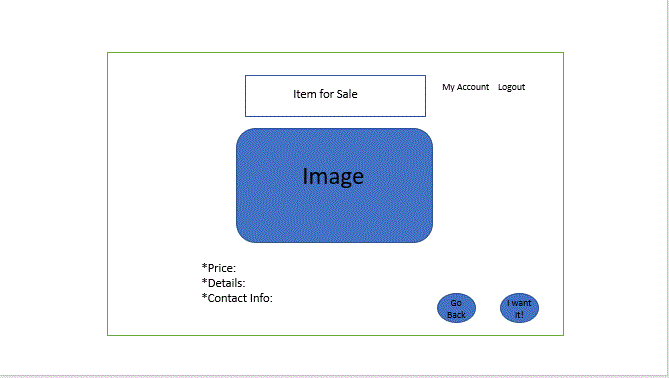

# Project 3 - NASA (Not Average Selling App)

August 3, 2019

## Project Members

- Marilyn Wadsworth
- Serena Brown
- Gezahegn Hika
- Paul Raab

## Project Title

## MVP
- Buy/Sell application - Our application will provide a platform to upload/purchase/allow communication between users to sell items.
- Why is a buting/selling app valuable? - This app will be useful because users can easily fill out a form and post items on the platform easily to sell.
- This app is strictly for people wanting to get rid of items, not merchandise. (kind of like Craigslist, but just selling items and easier to use).
- This app will be useful for people looking for a good deal and not wanting to by brand new items, ex: students looking for a microwave.

## Screen Layouts

#### Login Page

#### User Select Option

#### Buy Items - Search, Categories, Item Grid

#### Buy Items - Item Detail - Buy or Go Back

#### Shopping Cart

#### Sell Items

#### Nice to Have - Additional Screens

## Project Management

## Technology Stack

-   Technology our app will most likely use
- KanBan
- Node/Express
-   Passport
-   MongoDB/ Mongoose ORM
-   React
- ReactStrap
- StyledComponents
- SASS
- Heroku
- AWS/S3

##  Who's Doing What?
Dataflow: Paul
Making it pretty (React): Marilyn /Serena
Express server: Serena Paul
Database: Gezu

## Fun To Have

## GitHub and Heroku Repositories

[GitHub Repository](https://github.com/mwadsworth/project-threee/)

[Heroku Repository]()

