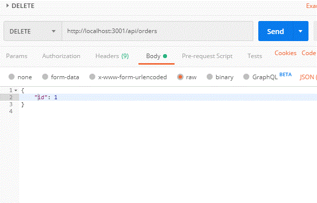

# Project 3 - APIs


[TOC]

## Overview

There are three initial GET APIs for Project3 to start building out front end functionality and to start testing the server/client/router functions. The data models used in the JSON here is just for testing - it will change.

## Schema

- The data for our application is stored in a MySQL schema called `projectdb`

- There are four tables called `users`, `items`, and `orders`, and `order_items`.

- To create and populate the schema run these scripts in your local MySQL instance. I use MySQL workbench:
  - ./db/schema.sql - creates projectdb schema
  - ./db/table_schema.sql - instantiate tables
  - ./db/views_schema.sql - create views
  - ./db/data.sql - populate test data
- Schema diagram

  

- Users table
````
CREATE TABLE IF NOT EXISTS users (
    id INT NOT NULL AUTO_INCREMENT,
    fullName VARCHAR(255) NOT NULL,
    password VARCHAR(255) NOT NULL,
    email VARCHAR(255) NOT NULL,
    createdAt DATETIME NOT NULL DEFAULT CURRENT_TIMESTAMP,
    updatedAt DATETIME NOT NULL DEFAULT CURRENT_TIMESTAMP,
    PRIMARY KEY (id),
    INDEX id_idx (id ASC)
);

````
- Items table
````
CREATE TABLE IF NOT EXISTS items (
    id INT NOT NULL AUTO_INCREMENT,
    ownerId INT NOT NULL,
    category VARCHAR(255) NOT NULL,
    itemName VARCHAR(255) NOT NULL,
    itemImage VARCHAR(255) NOT NULL,
	price VARCHAR(255) NOT NULL,
	sold BOOLEAN NOT NULL,
    createdAt DATETIME DEFAULT CURRENT_TIMESTAMP,
    updatedAt DATETIME DEFAULT CURRENT_TIMESTAMP,
    PRIMARY KEY (id),
    INDEX id_idx (id ASC),
    CONSTRAINT fk_owner_id FOREIGN KEY (ownerId)
        REFERENCES users (id)
        ON DELETE CASCADE ON UPDATE NO ACTION
);
````
- Orders table
````
CREATE TABLE IF NOT EXISTS orders (
    id INT NOT NULL AUTO_INCREMENT,
    buyerId INT NOT NULL,
    orderDate DATETIME DEFAULT CURRENT_TIMESTAMP,
    createdAt DATETIME DEFAULT CURRENT_TIMESTAMP,
    updatedAt DATETIME DEFAULT CURRENT_TIMESTAMP,
    PRIMARY KEY (id),
    INDEX id_idx (id ASC),
    CONSTRAINT fk_buyer_id FOREIGN KEY (buyerId)
        REFERENCES users (id)
        ON DELETE CASCADE ON UPDATE NO ACTION
);
````
- Orders Items table
````
CREATE TABLE IF NOT EXISTS order_items (
    orderId INT NOT NULL,
    itemId INT NOT NULL,
    createdAt DATETIME DEFAULT CURRENT_TIMESTAMP,
    updatedAt DATETIME DEFAULT CURRENT_TIMESTAMP,
    PRIMARY KEY (orderId, itemId),
    INDEX order_id_ixd (orderId ASC),
    INDEX item_id_ixd (itemId ASC),
    CONSTRAINT fk_order_id FOREIGN KEY (orderId)
        REFERENCES orders (id)
        ON DELETE CASCADE ON UPDATE NO ACTION,
    CONSTRAINT fk_item_id FOREIGN KEY (itemId)
        REFERENCES items (id)
        ON DELETE CASCADE ON UPDATE NO ACTION
);
````

## Route Details

- The routes are defined as Express routes in server.js 
```
  // Add routes, both API 
  // Get routes for CRUD
  require("./routes/api/apiUsersRoutes")(app);
  require("./routes/api/apiItemsRoutes")(app);
  require("./routes/api/apiOrdersRoutes")(app);
  require("./routes/api/apiOrderItemsRoutes")(app);
  require("./routes/api/apiUserItemsViewRoutes")(app);
  require("./routes/api/apiOrderItemsUsersViewRoutes")(app);
  require("./routes/api/apiOrderBuyersViewRoutes")(app);

```
## Users API Routes

- These APIs can be tested either in Postman or on your browser.

- localhost:3001/api/users GET

  ```
  [
  {
  "id": 1,
  "fullName": "Jane Doe",
  "password": "XXXXXX",
  "email": "jdoe@mail.com",
  "createdAt": "2019-08-17T11:43:58.000Z",
  "updatedAt": "2019-08-17T11:43:58.000Z"
  },
  {
  "id": 2,
  "fullName": "Joe Dokes",
  "password": "XXXXXX",
  "email": "jdokes@mail.com",
  "createdAt": "2019-08-17T11:43:58.000Z",
  "updatedAt": "2019-08-17T11:43:58.000Z"
  },
  {
  "id": 4,
  "fullName": "Ernie Pyle",
  "password": "XXXXXX",
  "email": "epyle@mail.com",
  "createdAt": "2019-08-17T11:43:58.000Z",
  "updatedAt": "2019-08-17T11:43:58.000Z"
  }
  ]
  ```

- localhost:3001/api/users POST


- localhost:3001/api/users PUT


- localhost:3001/api/users DELETE



## Items API Routes

- localhost:3001/api/items GET

```
[
{
"id": 1,
"ownerId": 1,
"category": "Furniture",
"itemName": "Sofa",
"itemImage": "https://previews.123rf.com/images/seamartini/seamartini1403/seamartini140300410/26847602-cartoon-upholstered-orange-couch-sofa-or-settee-with-a-happy-smile-vector-illustration-isolated-on-w.jpg",
"price": "$10.00",
"sold": false,
"createdAt": "2019-08-17T11:43:58.000Z",
"updatedAt": "2019-08-17T11:43:58.000Z"
},
{
"id": 2,
"ownerId": 1,
"category": "Furniture",
"itemName": "Chair",
"itemImage": "https://img.pngio.com/cartoon-chair-cartoon-clipart-red-cartoon-png-image-and-clipart-cartoon-chair-639_925.png",
"price": "$5.00",
"sold": false,
"createdAt": "2019-08-17T11:43:58.000Z",
"updatedAt": "2019-08-17T11:43:58.000Z"
},
{
"id": 3,
"ownerId": 2,
"category": "Other",
"itemName": "Lawn Mower",
"itemImage": "https://image.shutterstock.com/image-vector/lawn-mower-260nw-137117294.jpg",
"price": "$20.00",
"sold": false,
"createdAt": "2019-08-17T11:43:58.000Z",
"updatedAt": "2019-08-17T11:43:58.000Z"
},
{
"id": 4,
"ownerId": 2,
"category": "Other",
"itemName": "Shovel",
"itemImage": "https://previews.123rf.com/images/lineartestpilot/lineartestpilot1802/lineartestpilot180218348/94930617-cartoon-shovel-illustration-design-.jpg",
"price": "$2.00",
"sold": false,
"createdAt": "2019-08-17T11:43:58.000Z",
"updatedAt": "2019-08-17T11:43:58.000Z"
}
]
```

- localhost:3001/api/items POST

- localhost:3001/api/items PUT

- localhost:3001/api/items DELETE

## Orders API Routes

- localhost:3001/api/orders GET

```
[
{
"id": 1,
"buyerId": 1,
"orderDate": "2019-08-17T11:43:58.000Z",
"createdAt": "2019-08-17T11:43:58.000Z",
"updatedAt": "2019-08-17T11:43:58.000Z"
},
{
"id": 2,
"buyerId": 2,
"orderDate": "2019-08-17T11:43:58.000Z",
"createdAt": "2019-08-17T11:43:58.000Z",
"updatedAt": "2019-08-17T11:43:58.000Z"
}
]
```

- localhost:3001/api/orders POST

- localhost:3001/api/orders PUT

- localhost:3001/api/orders DELETE

## Order Items API Routes

- localhost:3001/api/order/items GET

```
[
{
"orderId": 1,
"itemId": 1,
"createdAt": "2019-08-17T11:43:58.000Z",
"updatedAt": "2019-08-17T11:43:58.000Z"
},
{
"orderId": 1,
"itemId": 3,
"createdAt": "2019-08-17T11:43:58.000Z",
"updatedAt": "2019-08-17T11:43:58.000Z"
},
{
"orderId": 2,
"itemId": 2,
"createdAt": "2019-08-17T11:43:58.000Z",
"updatedAt": "2019-08-17T11:43:58.000Z"
},
{
"orderId": 2,
"itemId": 4,
"createdAt": "2019-08-17T11:43:58.000Z",
"updatedAt": "2019-08-17T11:43:58.000Z"
}
]
```

- localhost:3001/api/order/items POST
- localhost:3001/api/order/items PUT
- localhost:3001/api/order/items DELETE

## Order Items Users View API Routes

- localhost:3001/api/order_items_users_view GET

```
[
{
"orderId": 1,
"buyerId": 1,
"buyerName": "Jane Doe",
"orderDate": "2019-08-17T11:43:58.000Z",
"itemId": 1,
"ownerId": 1,
"ownerName": "Jane Doe",
"category": "Furniture",
"itemName": "Sofa",
"itemImage": "https://previews.123rf.com/images/seamartini/seamartini1403/seamartini140300410/26847602-cartoon-upholstered-orange-couch-sofa-or-settee-with-a-happy-smile-vector-illustration-isolated-on-w.jpg",
"price": "$10.00"
},
{
"orderId": 1,
"buyerId": 1,
"buyerName": "Jane Doe",
"orderDate": "2019-08-17T11:43:58.000Z",
"itemId": 3,
"ownerId": 2,
"ownerName": "Joe Dokes",
"category": "Other",
"itemName": "Lawn Mower",
"itemImage": "https://image.shutterstock.com/image-vector/lawn-mower-260nw-137117294.jpg",
"price": "$20.00"
},
{
"orderId": 2,
"buyerId": 2,
"buyerName": "Joe Dokes",
"orderDate": "2019-08-17T11:43:58.000Z",
"itemId": 2,
"ownerId": 1,
"ownerName": "Jane Doe",
"category": "Furniture",
"itemName": "Chair",
"itemImage": "https://img.pngio.com/cartoon-chair-cartoon-clipart-red-cartoon-png-image-and-clipart-cartoon-chair-639_925.png",
"price": "$5.00"
},
{
"orderId": 2,
"buyerId": 2,
"buyerName": "Joe Dokes",
"orderDate": "2019-08-17T11:43:58.000Z",
"itemId": 4,
"ownerId": 2,
"ownerName": "Joe Dokes",
"category": "Other",
"itemName": "Shovel",
"itemImage": "https://previews.123rf.com/images/lineartestpilot/lineartestpilot1802/lineartestpilot180218348/94930617-cartoon-shovel-illustration-design-.jpg",
"price": "$2.00"
}
]
```

## Order Buyers View API Routes

- localhost:3001/api/order_buyers_view GET

  ```
  [
  {
  "orderId": 1,
  "buyerId": 1,
  "buyerName": "Jane Doe",
  "orderDate": "2019-08-17T11:43:58.000Z"
  },
  {
  "orderId": 2,
  "buyerId": 2,
  "buyerName": "Joe Dokes",
  "orderDate": "2019-08-17T11:43:58.000Z"
  }
  ]
  ```

  

## User Items View API Routes

- localhost:3001/api/user_items_view GET

  ```
  [
  {
  "ownerId": 1,
  "ownerName": "Jane Doe",
  "contact": "new@mail.com",
  "itemId": 1,
  "category": "Furniture",
  "itemName": "Sofa",
  "itemImage": "https://previews.123rf.com/images/seamartini/seamartini1403/seamartini140300410/26847602-cartoon-upholstered-orange-couch-sofa-or-settee-with-a-happy-smile-vector-illustration-isolated-on-w.jpg",
  "price": "$10.00"
  },
  {
  "ownerId": 1,
  "ownerName": "Jane Doe",
  "contact": "new@mail.com",
  "itemId": 2,
  "category": "Furniture",
  "itemName": "Chair",
  "itemImage": "https://img.pngio.com/cartoon-chair-cartoon-clipart-red-cartoon-png-image-and-clipart-cartoon-chair-639_925.png",
  "price": "$5.00"
  },
  {
  "ownerId": 2,
  "ownerName": "Joe Dokes",
  "contact": "jdokes@mail.com",
  "itemId": 3,
  "category": "Other",
  "itemName": "Lawn Mower",
  "itemImage": "https://image.shutterstock.com/image-vector/lawn-mower-260nw-137117294.jpg",
  "price": "$20.00"
  },
  {
  "ownerId": 2,
  "ownerName": "Joe Dokes",
  "contact": "jdokes@mail.com",
  "itemId": 4,
  "category": "Other",
  "itemName": "Shovel",
  "itemImage": "https://previews.123rf.com/images/lineartestpilot/lineartestpilot1802/lineartestpilot180218348/94930617-cartoon-shovel-illustration-design-.jpg",
  "price": "$2.00"
  }
  ]
  ```

  