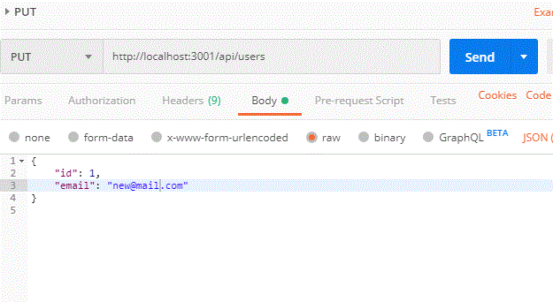

# Project 3 - APIs


[TOC]

## Overview

There are three initial GET APIs for Project3 to start building out front end functionality and to start testing the server/client/router functions. The data models used in the JSON here is just for testing - it will change.

## Schema

- The data for our application is stored in a MongoDB schema called `projectdb`

- There are three collections called `users`, `items`, and `orders`.

- To create and populate the schema run:

  - $ npm run seed - this executes the script ./scripts/seedDB.js.

- Users defined in ./models/users.js as:

  ````const mongoose = require("mongoose");
  const mongoose = require("mongoose");
  const Schema = mongoose.Schema;
  
  const usersSchema = new Schema({
    fullName: { type: String, required: true },
    email: { type: String, required: true },
    password: { type: String, required: true }
  });
  
  const Users = mongoose.model("Users", usersSchema);
  
  module.exports = Users;
  ````
  
- Items defined in ./models/items.js as:
  
  ```
  const mongoose = require("mongoose");
  const Schema = mongoose.Schema;
  
  const itemsSchema = new Schema({
    ownerName: { type: String, required: true },
    contact: { type: String, required: true },
    category: { type: String, required: true },
    itemName: { type: String, required: true },
    itemImage: { type: String, required: true },
    price: { type: String, required: true }
  });
  
  const Items = mongoose.model("Items", itemsSchema);
  
  module.exports = Items;
  
  ```
  
  
  
- Orders defined in ./models/orders.js as:

  ```
  const mongoose = require("mongoose");
  const Schema = mongoose.Schema;
  
  const itemsSchema = new Schema({
    ownerName: { type: String, required: true },
    contact: { type: String, required: true },
    category: { type: String, required: true },
    itemName: { type: String, required: true },
    itemImage: { type: String, required: true },
    price: { type: String, required: true }
  });
  
  const ordersSchema = new Schema({
    buyerName: { type: String, required: true },
    orderDate: { type: Date, default: Date.now },
    items: [itemsSchema]
  });
  
  const Orders = mongoose.model("Orders", ordersSchema);
  
  module.exports = Orders;
  
  ```
  
  

## Route Details

- The routes are defined as Express routes in server.js 
  ```
  // Add routes, both API and view
  app.use(routes);
  ```
  and ./api/index.js

  ```
  const router = require("express").Router();
  const userRoutes = require("./users");
  const itemRoutes = require("./items");
  const orderRoutes = require("./orders");
  const bookRoutes = require("./books");
  
  // Routes
  router.use("/users", userRoutes);
  router.use("/items", itemRoutes);
  router.use("/orders", orderRoutes);
  router.use("/books", bookRoutes);
  
  module.exports = router;  
  ```
  
- The detailed API routes are defined in ./api/users.js, ./api/items.js, ./api/orders.js

- The database stubs called by the API functions are defined in ./controllers as users.js, items.js, and orders.js. For right now these functions read and return an array of jSON objects as described below.

- These APIs can be tested either in Postman or on your browser.
## Users API Routes

- localhost:3001/api/users GET

```
[
{
"_id": "5d4f110aa41d9c569096c5bb",
"fullName": "Jane Doe",
"email": "jdoe@lct.com",
"password": "XXXXXX"
},
{
"_id": "5d4f110aa41d9c569096c5bc",
"fullName": "Joe Dokes",
"email": "jdokes@lct.com",
"password": "XXXXXX"
},
{
"_id": "5d4f110aa41d9c569096c5bd",
"fullName": "Ernie Pyle",
"email": "epyle@lct.com",
"password": "XXXXXX"
}
]
```

- localhost:3001/api/users POST


- localhost:3001/api/users PUT



- localhost:3001/api/users DELETE


## Items API Routes

- localhost:3001/api/items GET

```
[
{
"_id": "5d4f110aa41d9c569096c5be",
"ownerName": "Jane Doe",
"contact": "jdoe@lct.com",
"category": "Furniture",
"itemName": "Sofa",
"itemImage": "image1.png",
"price": "$10.00"
},
{
"_id": "5d4f110aa41d9c569096c5bf",
"ownerName": "Jane Doe",
"contact": "jdoe@lct.com",
"category": "Furniture",
"itemName": "Chair",
"itemImage": "image2.png",
"price": "$5.00"
},
{
"_id": "5d4f110aa41d9c569096c5c0",
"ownerName": "Joe Dokes",
"contact": "jdokes@lct.com",
"category": "Other",
"itemName": "Lawn Mower",
"itemImage": "image3.png",
"price": "$20.00"
},
{
"_id": "5d4f110aa41d9c569096c5c1",
"ownerName": "Joe Dokes",
"contact": "jdokes@lct.com",
"category": "Other",
"itemName": "Shovel",
"itemImage": "image4.png",
"price": "$2.00"
}
]
```

- localhost:3001/api/items POST

- localhost:3001/api/items PUT

- localhost:3001/api/items DELETE

## Orders API Routes

- localhost:3001/api/orders GET

```
[
	{
	"_id": "5d4f110aa41d9c569096c5c2",
	"buyerName": "Jane Doe",
	"orderDate": "2019-08-01T06:00:00.000Z",
	"items": [
			{
			"ownerName": "Jane Doe",
			"contact": "jdoe@lct.com",
			"category": "Furniture",
			"itemName": "Sofa",
			"itemImage": "image1.png",
			"price": "$10.00"
			},
			{
			ownerName": "Joe Dokes",
			contact": "jdokes@lct.com",
			category": "Other",
			itemName": "Lawn Mower",
			itemImage": "image3.png",
			price": "$20.00"
			
			
},
{
	_id": "5d4f110aa41d9c569096c5c3",
	"buyerName": "Joe Dokes",
	"orderDate": "2019-08-01T06:00:00.000Z",
	"items": [
			{
			"ownerName": "Jane Doe",
			"contact": "jdoe@lct.com",
			"category": "Furniture",
			"itemName": "Sofa",
			"itemImage": "image1.png",
			"price": "$10.00"
			},
			{
			"ownerName": "Joe Dokes",
			"contact": "jdokes@lct.com",
			"category": "Other",
			"itemName": "Shovel",
			"itemImage": "image4.png",
			"price": "$2.00"
			}
			]
}
]
```

- localhost:3001/api/orders POST

- localhost:3001/api/orders PUT

- localhost:3001/api/orders DELETE
